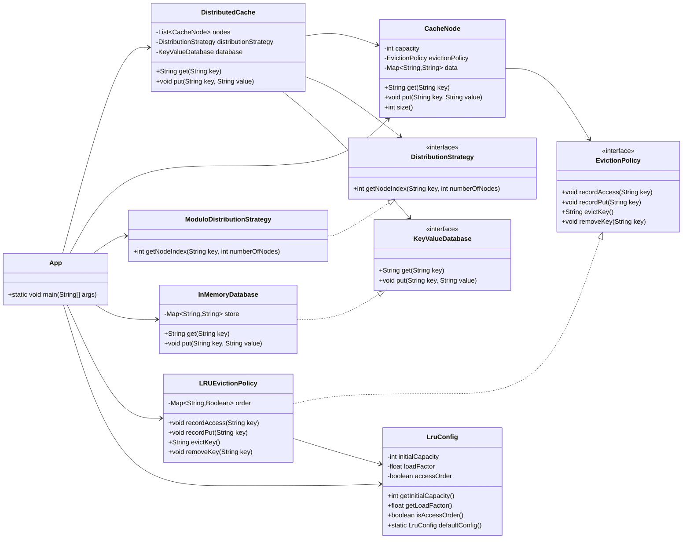

## Class Diagram


```mermaid
classDiagram
    direction LR
    class DistributedCache {
        -List~CacheNode~ nodes
        -DistributionStrategy distributionStrategy
        -KeyValueDatabase database
        +String get(String key)
        +void put(String key, String value)
    }

    class CacheNode {
        -int capacity
        -EvictionPolicy evictionPolicy
        -Map~String,String~ data
        +String get(String key)
        +void put(String key, String value)
        +int size()
    }

    class DistributionStrategy {
        <<interface>>
        +int getNodeIndex(String key, int numberOfNodes)
    }

    class ModuloDistributionStrategy {
        +int getNodeIndex(String key, int numberOfNodes)
    }

    class EvictionPolicy {
        <<interface>>
        +void recordAccess(String key)
        +void recordPut(String key)
        +String evictKey()
        +void removeKey(String key)
    }

    class LRUEvictionPolicy {
        -Map~String,Boolean~ order
        +void recordAccess(String key)
        +void recordPut(String key)
        +String evictKey()
        +void removeKey(String key)
    }

    class LruConfig {
        -int initialCapacity
        -float loadFactor
        -boolean accessOrder
        +int getInitialCapacity()
        +float getLoadFactor()
        +boolean isAccessOrder()
        +static LruConfig defaultConfig()
    }

    class KeyValueDatabase {
        <<interface>>
        +String get(String key)
        +void put(String key, String value)
    }

    class InMemoryDatabase {
        -Map~String,String~ store
        +String get(String key)
        +void put(String key, String value)
    }

    class App {
        +static void main(String[] args)
    }

    DistributedCache --> CacheNode
    DistributedCache --> DistributionStrategy
    DistributedCache --> KeyValueDatabase
    CacheNode --> EvictionPolicy
    ModuloDistributionStrategy ..|> DistributionStrategy
    LRUEvictionPolicy ..|> EvictionPolicy
    LRUEvictionPolicy --> LruConfig
    InMemoryDatabase ..|> KeyValueDatabase
    App --> DistributedCache
    App --> CacheNode
    App --> ModuloDistributionStrategy
    App --> InMemoryDatabase
    App --> LRUEvictionPolicy
    App --> LruConfig
```

## How to run

From this folder:

```bash
javac com/example/cache/*.java
java com.example.cache.App
```

