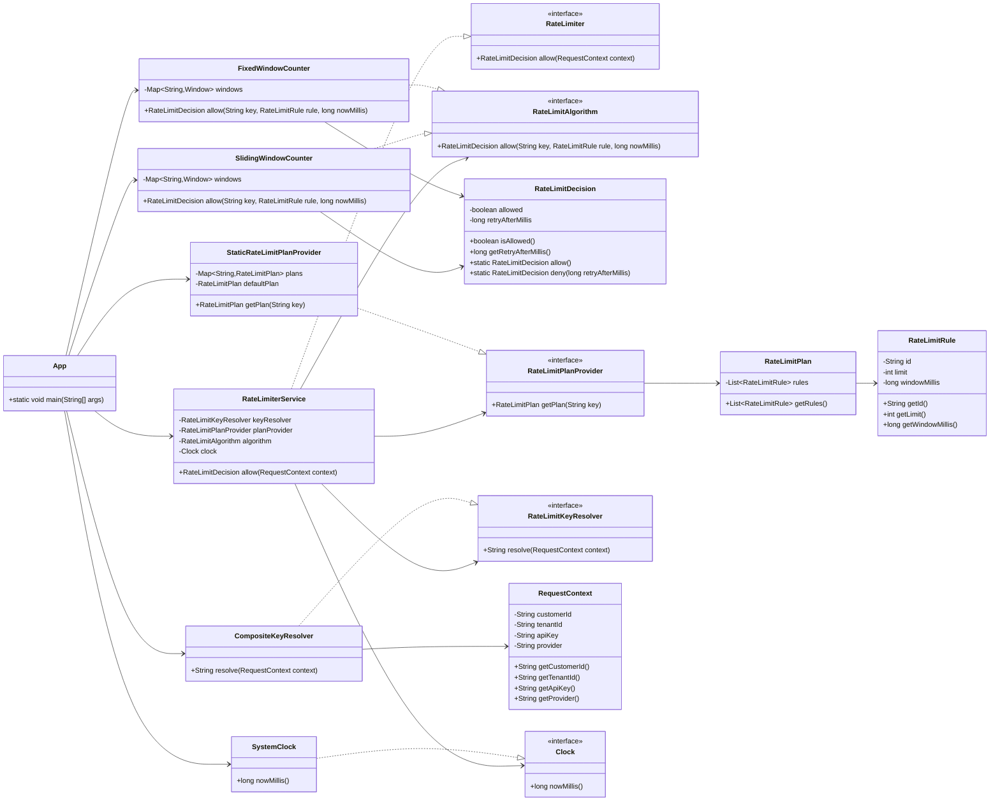

## Class Diagram


```mermaid
classDiagram
    direction LR

    class RateLimiter {
        <<interface>>
        +RateLimitDecision allow(RequestContext context)
    }

    class RateLimiterService {
        -RateLimitKeyResolver keyResolver
        -RateLimitPlanProvider planProvider
        -RateLimitAlgorithm algorithm
        -Clock clock
        +RateLimitDecision allow(RequestContext context)
    }

    class RateLimitAlgorithm {
        <<interface>>
        +RateLimitDecision allow(String key, RateLimitRule rule, long nowMillis)
    }

    class FixedWindowCounter {
        -Map~String,Window~ windows
        +RateLimitDecision allow(String key, RateLimitRule rule, long nowMillis)
    }

    class SlidingWindowCounter {
        -Map~String,Window~ windows
        +RateLimitDecision allow(String key, RateLimitRule rule, long nowMillis)
    }

    class RateLimitDecision {
        -boolean allowed
        -long retryAfterMillis
        +boolean isAllowed()
        +long getRetryAfterMillis()
        +static RateLimitDecision allow()
        +static RateLimitDecision deny(long retryAfterMillis)
    }

    class RateLimitPlanProvider {
        <<interface>>
        +RateLimitPlan getPlan(String key)
    }

    class StaticRateLimitPlanProvider {
        -Map~String,RateLimitPlan~ plans
        -RateLimitPlan defaultPlan
        +RateLimitPlan getPlan(String key)
    }

    class RateLimitPlan {
        -List~RateLimitRule~ rules
        +List~RateLimitRule~ getRules()
    }

    class RateLimitRule {
        -String id
        -int limit
        -long windowMillis
        +String getId()
        +int getLimit()
        +long getWindowMillis()
    }

    class RateLimitKeyResolver {
        <<interface>>
        +String resolve(RequestContext context)
    }

    class CompositeKeyResolver {
        +String resolve(RequestContext context)
    }

    class RequestContext {
        -String customerId
        -String tenantId
        -String apiKey
        -String provider
        +String getCustomerId()
        +String getTenantId()
        +String getApiKey()
        +String getProvider()
    }

    class Clock {
        <<interface>>
        +long nowMillis()
    }

    class SystemClock {
        +long nowMillis()
    }

    class App {
        +static void main(String[] args)
    }

    RateLimiterService ..|> RateLimiter
    FixedWindowCounter ..|> RateLimitAlgorithm
    SlidingWindowCounter ..|> RateLimitAlgorithm
    CompositeKeyResolver ..|> RateLimitKeyResolver
    SystemClock ..|> Clock
    StaticRateLimitPlanProvider ..|> RateLimitPlanProvider

    RateLimiterService --> RateLimitKeyResolver
    RateLimiterService --> RateLimitPlanProvider
    RateLimiterService --> RateLimitAlgorithm
    RateLimiterService --> Clock

    FixedWindowCounter --> RateLimitDecision
    SlidingWindowCounter --> RateLimitDecision
    RateLimitPlanProvider --> RateLimitPlan
    RateLimitPlan --> RateLimitRule
    CompositeKeyResolver --> RequestContext

    App --> RateLimiterService
    App --> FixedWindowCounter
    App --> SlidingWindowCounter
    App --> CompositeKeyResolver
    App --> StaticRateLimitPlanProvider
    App --> SystemClock
```

## How to Run

From this folder:

```bash
javac com/example/limiter/*.java
java com.example.limiter.App
```
